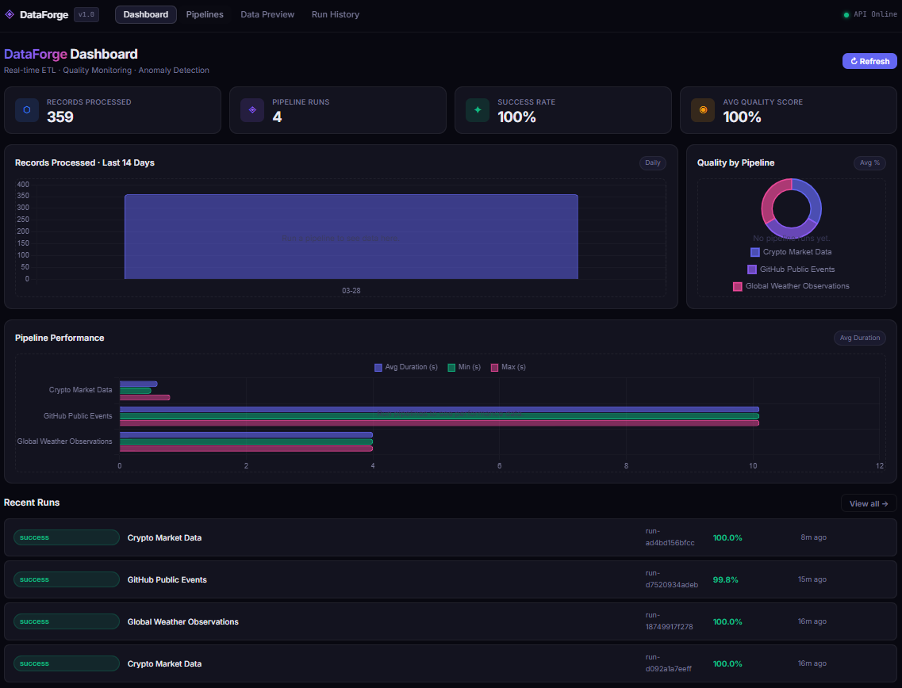
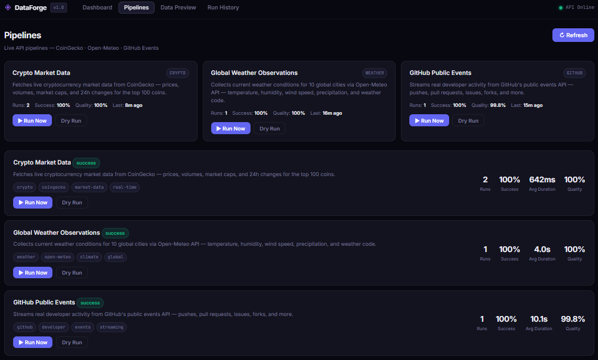
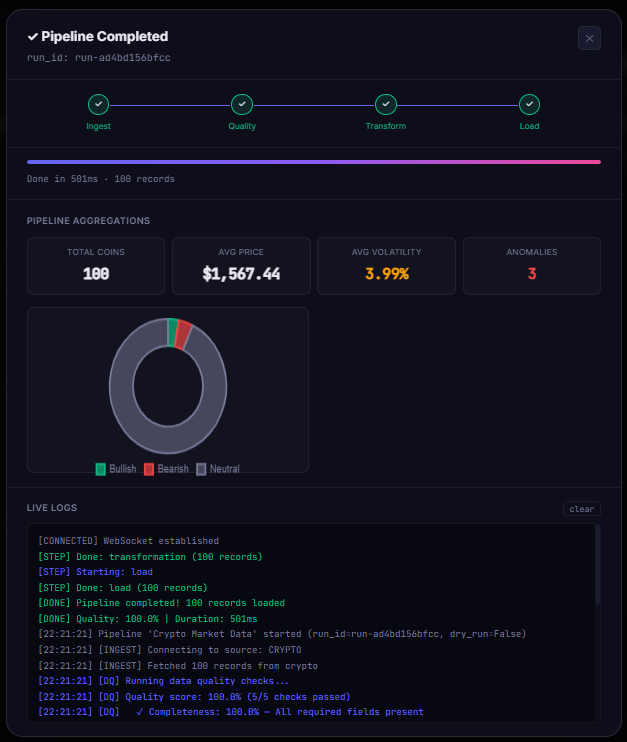
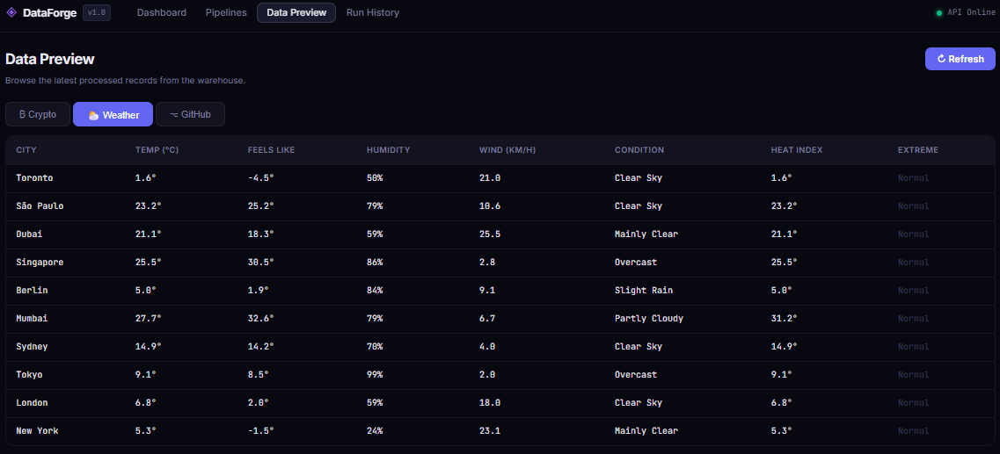
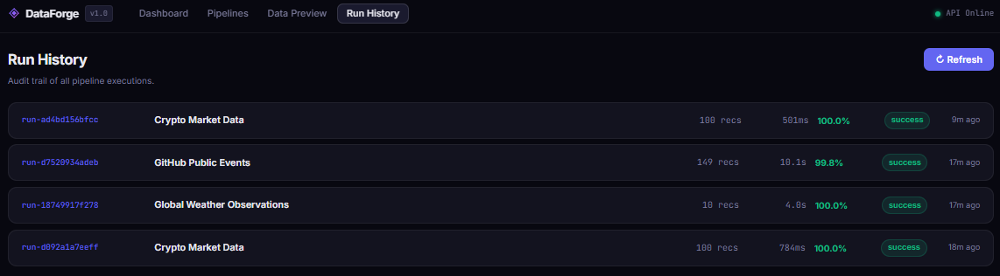

# ◈ DataForge — Real-Time ETL Pipeline & Analytics Platform

> A production-grade data engineering platform for ingesting, transforming, validating, and loading real-time data from live APIs — with a monitoring dashboard and WebSocket-powered updates.

🔗 **Live Demo**: [etl.anirudhdev.com](https://etl.anirudhdev.com)


---

## Overview

DataForge is a full-stack data engineering platform that demonstrates end-to-end ETL pipeline design, real-time data quality monitoring, and scalable API architecture. It connects to **live public APIs** to ingest, transform, and analyze real-world data.

**Key capabilities:**
- Multi-source data ingestion from live APIs (CoinLore, Open-Meteo, GitHub Events)
- Statistical anomaly detection using Z-score analysis
- 5-dimension data quality framework (Completeness, Validity, Uniqueness, Timeliness, Consistency)
- Real-time pipeline progress via WebSockets + polling fallback
- Interactive analytics dashboard with Chart.js visualizations

---

## Screenshots

### Dashboard
Real-time KPI cards, records processed chart, quality-by-pipeline breakdown, pipeline performance, and recent runs — all in one view.



### Pipelines
All three live API pipelines with run stats, success rates, quality scores, and one-click execution.



### Pipeline Execution
Live WebSocket-powered pipeline run with step-by-step progress (Ingest → Quality → Transform → Load), aggregations, anomaly counts, and streaming logs.



### Data Preview
Browse transformed records from the warehouse — crypto prices, global weather observations, and GitHub developer activity.



### Run History
Full audit trail of every pipeline execution with record counts, durations, quality scores, and status.



---

## Architecture

```
┌─────────────────────────────────────────────────────────────────────┐
│                        DataForge Platform                           │
│                                                                     │
│  ┌──────────────┐    ┌────────────────────────────────────────────┐ │
│  │   Frontend   │    │              Pipeline Engine               │ │
│  │              │    │                                            │ │
│  │  Dashboard   │◄──►│  ┌──────────┐ ┌────────┐ ┌────────────┐  │ │
│  │  Charts      │WS  │  │ Ingest   │►│Quality │►│ Transform  │  │ │
│  │  Live Logs   │    │  │ CSV/API/ │ │ Checks │ │ Enrich     │  │ │
│  │  Data Table  │    │  │ Stream   │ │ 5-dim  │ │ Dedupe     │  │ │
│  └──────────────┘    │  └──────────┘ └────────┘ │ Anomaly    │  │ │
│         │            │                           │ Aggregate  │  │ │
│         │            │                           └─────┬──────┘  │ │
│         ▼            │                                 ▼         │ │
│  ┌──────────────┐    │  ┌──────────────────────────────────────┐ │ │
│  │  FastAPI     │    │  │          Data Warehouse               │ │ │
│  │  REST API    │    │  │  SQLite (dev) / PostgreSQL (prod)     │ │ │
│  │  WebSocket   │◄───┤  │  crypto · weather · github records   │ │ │
│  │  /api/...    │    │  │  pipeline_runs · pipeline_metrics    │ │ │
│  └──────────────┘    │  └──────────────────────────────────────┘ │ │
│                      └────────────────────────────────────────────┘ │
└─────────────────────────────────────────────────────────────────────┘
```

---

## Tech Stack

| Layer | Technology |
|---|---|
| **API** | FastAPI 0.115, Uvicorn, WebSockets |
| **Data Processing** | Python 3.12, Pandas-style algorithms, asyncio |
| **Database** | SQLite + aiosqlite (async), schema-forward design |
| **Frontend** | Vanilla JS/HTML/CSS, Chart.js, WebSocket API |
| **Infrastructure** | Docker, Docker Compose, Nginx reverse proxy |
| **CI/CD** | GitHub Actions (lint → test → docker build → security audit) |
| **Testing** | Pytest, pytest-asyncio, httpx (ASGI transport) |

---

## Features

### ETL Pipeline Engine

Three built-in pipelines with live API data sources:

| Pipeline | Source API | Data | Records |
|---|---|---|---|
| Crypto Market Data | [CoinLore](https://www.coinlore.com/cryptocurrency-data-api) | Top 50–100 coins: prices, volumes, market cap | ~100/run |
| Global Weather Observations | [Open-Meteo](https://open-meteo.com/) | 10 global cities: temperature, humidity, wind | ~10/run |
| GitHub Public Events | [GitHub Events API](https://docs.github.com/en/rest/activity/events) | Pushes, PRs, issues, forks | ~90/run |

### Data Quality Framework

Every pipeline run executes 5 quality checks with weighted scoring:

| Check | Weight | Description |
|---|---|---|
| **Completeness** | 25% | Required fields are non-null |
| **Validity** | 25% | Values within expected domains |
| **Uniqueness** | 20% | No duplicate order IDs |
| **Timeliness** | 15% | Timestamps within 90-day window |
| **Consistency** | 15% | Cross-field logical consistency |

### Anomaly Detection

Statistical Z-score analysis flags orders where `|z| > 3.5` deviations from the mean — surfacing fraud, pricing errors, or data issues in real time.

### REST API

| Method | Endpoint | Description |
|---|---|---|
| `GET` | `/api/pipelines` | List all pipelines with live stats |
| `GET` | `/api/pipelines/{id}` | Pipeline details + recent runs |
| `POST` | `/api/pipelines/{id}/trigger` | Trigger a run (supports dry_run) |
| `GET` | `/api/runs` | Run history with filtering |
| `GET` | `/api/runs/{run_id}` | Full run details + quality checks |
| `GET` | `/api/runs/{run_id}/logs` | Execution logs |
| `GET` | `/api/data/preview` | Browse processed records |
| `GET` | `/api/metrics` | Platform-wide aggregated metrics |
| `WS` | `/ws/runs/{run_id}` | Real-time pipeline events |
| `GET` | `/api/health` | Health check |

---

## Quick Start

### Option 1 — Docker Compose (recommended)

```bash
git clone https://github.com/Anicherry780/dataforge.git
cd dataforge
docker compose up --build
```

Open **http://localhost** for the dashboard, **http://localhost:8000/api/docs** for Swagger.

### Option 3 — Cloud Deployment (Cloudflare Pages + Render)

The live demo uses this architecture:
- **Frontend** → [Cloudflare Pages](https://pages.cloudflare.com/) (free, static hosting)
- **Backend** → [Render](https://render.com/) (free tier, Docker deploy)

```bash
# Set the API URL in frontend/index.html:
window.__DATAFORGE_API__ = 'https://your-app.onrender.com';

# Optional: set GITHUB_TOKEN env var on Render for higher GitHub API rate limits
```

### Option 2 — Local Development

```bash
# Backend
cd backend
python -m venv venv && source venv/bin/activate  # Windows: venv\Scripts\activate
pip install -r requirements.txt
uvicorn app.main:app --reload --port 8000

# The frontend is served by FastAPI at http://localhost:8000
```

### Running Tests

```bash
cd backend
pytest tests/ -v --asyncio-mode=auto
```

---

## Project Structure

```
dataforge/
├── backend/
│   ├── app/
│   │   ├── main.py                    # FastAPI app, WebSocket endpoint
│   │   ├── models.py                  # Pydantic schemas (if needed)
│   │   ├── database.py                # Async SQLite layer
│   │   ├── core/
│   │   │   └── connection_manager.py  # WebSocket connection pool
│   │   ├── pipeline/
│   │   │   ├── engine.py              # Pipeline orchestrator
│   │   │   ├── ingestion.py           # CoinLore / Open-Meteo / GitHub connectors
│   │   │   ├── transformation.py      # Dedupe, enrich, anomaly detection
│   │   │   ├── quality.py             # 5-dimension DQ framework
│   │   │   └── loader.py              # Batch warehouse loader
│   │   └── api/
│   │       └── routes.py              # REST API endpoints
│   ├── tests/
│   │   ├── test_pipeline.py           # Unit tests for pipeline logic
│   │   └── test_api.py                # Integration tests for API
│   ├── requirements.txt
│   └── Dockerfile
├── frontend/
│   ├── index.html                     # SPA dashboard
│   ├── styles.css                     # Dark theme UI system
│   └── app.js                         # WebSocket client + Chart.js
├── .github/
│   └── workflows/
│       └── ci.yml                     # Lint → Test → Docker → Security
├── docker-compose.yml
├── nginx.conf
└── .env.example
```

---

## Design Decisions

**Why SQLite (not PostgreSQL)?**
SQLite with async I/O via `aiosqlite` is sufficient for this demo and removes infrastructure dependencies. In production, swap `database.py` for an async SQLAlchemy engine pointed at PostgreSQL or Snowflake — the interface stays the same.

**Why WebSockets over polling?**
Polling has inherent latency and wastes connections. WebSockets provide sub-100ms event delivery, critical for the "live logs" UX. The `ConnectionManager` handles fan-out to multiple dashboard tabs simultaneously.

**Why vanilla JS (no React/Vue)?**
The frontend has no build step, making it trivially deployable anywhere. For a team project, the JS layer is architected with a clear state/render separation and could be migrated to React incrementally.

**Why async everywhere?**
Pipeline runs can take 10–30 seconds. Async Python (asyncio + aiosqlite + FastAPI) keeps the API responsive for concurrent users during runs, without threading complexity.

---

## Extending DataForge

Production extensions to discuss in interviews:

- **Add data sources**: Add new ingestion classes (e.g., `KafkaConsumer`, `S3Reader`, custom REST APIs)
- **Scale the warehouse**: Point `database.py` at BigQuery, Snowflake, or Redshift
- **Add orchestration**: Wrap `execute_pipeline()` with Airflow/Prefect DAGs
- **Observability**: Add OpenTelemetry tracing to each pipeline step
- **Schema registry**: Add Avro/Protobuf schema validation in the quality layer
- **Backfill support**: Add `date_range` parameter to ingestion sources

---

## License

MIT — built by [Anirudh](https://anirudhdev.com) · Live at [etl.anirudhdev.com](https://etl.anirudhdev.com)
